# WWDC18Features

What's new in WWDC18

Original article was published at https://developer.apple.com/videos/wwdc2018/

[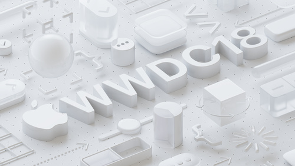](https://developer.apple.com/videos/play/wwdc2018/101/)

## [WWDC 2018 Keynote](https://developer.apple.com/videos/play/wwdc2018/101/)

  WWDC 2018 Keynote

[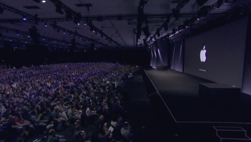](https://developer.apple.com/videos/play/wwdc2018/102/)

## [Platforms State of the Union](https://developer.apple.com/videos/play/wwdc2018/102/)

  2018 Platforms State of the Union

## [Machine Learning Get-Together](https://developer.apple.com/videos/play/wwdc2018/110/)

  Meet up with many of Apple's Machine Learning experts as well as others in the ML community to chat about Apple's recent ML announcements, make connections with developers working in similar areas to yours, and exchange ideas and views on all aspects of ML.

## [Creating Apps for a Global Audience](https://developer.apple.com/videos/play/wwdc2018/201/)

  Common assumptions can break when your app is used by a global audience. Learn about the many aspects of creating apps for different regions and languages. Understand how to use fonts and typography, layout techniques, and support text input so your app shines in all languages.

[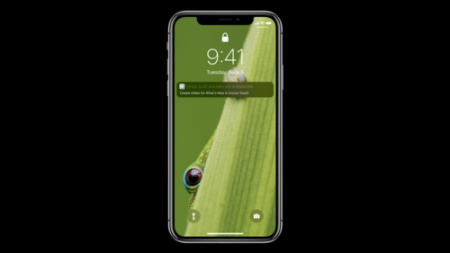](https://developer.apple.com/videos/play/wwdc2018/202/)

## [What's New in Cocoa Touch](https://developer.apple.com/videos/play/wwdc2018/202/)

  iOS 12 enhances the Cocoa Touch frameworks to improve app performance and deliver exciting new features. Learn about performance best practices, security improvements, tools for supporting multiple screen sizes and shapes, new APIs for iMessage apps, Siri Shortcuts, and Swift refinements. Find...

[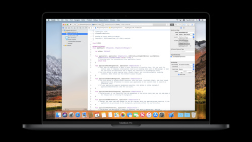](https://developer.apple.com/videos/play/wwdc2018/203/)

## [I Have This Idea For An App...](https://developer.apple.com/videos/play/wwdc2018/203/)

  Do you have an idea for an app that you think would be useful to others, but you don't know how to make it a reality? You're not alone! Lots of people are interested in app development, but they aren't sure how to turn their idea to code and then into a finished app. From first steps to Xcode,...

[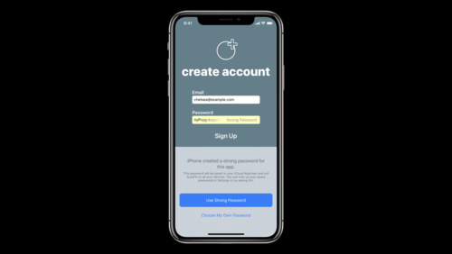](https://developer.apple.com/videos/play/wwdc2018/204/)

## [Automatic Strong Passwords and Security Code AutoFill](https://developer.apple.com/videos/play/wwdc2018/204/)

  Passwords and security codes are a modern necessity required for security and privacy. iOS 12 eases the tedious aspects of account setup and sign-in by automatically suggesting and using strong, unique passwords — even from within apps — and by bringing one-time codes to the QuickType bar so...

[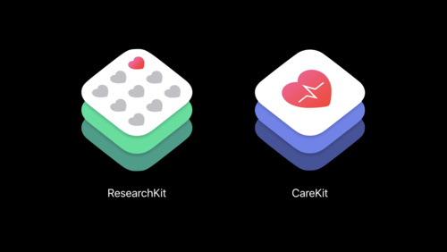](https://developer.apple.com/videos/play/wwdc2018/205/)

## [Advances in Research and Care Frameworks](https://developer.apple.com/videos/play/wwdc2018/205/)

  HealthKit, CoreMotion, and other iOS frameworks combined with the ResearchKit and CareKit open-source projects, provide a deep platform for the creation of game-changing apps for care teams, researchers, and the medical community. Discover new active tasks that leverage calibrated device data and...

## [What's New in watchOS](https://developer.apple.com/videos/play/wwdc2018/206/)

  watchOS 5 makes creating great experiences on Apple Watch easier than ever before. Learn about robust capabilities to create rich and interactive notifications, a new background mode and controls for audio playback, shortcuts that bring your apps to the Siri watch face, and more. See what's new...

[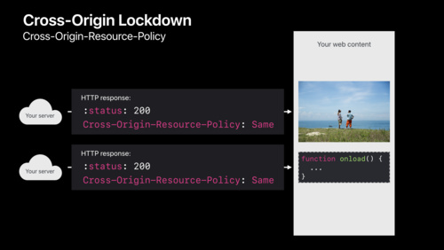](https://developer.apple.com/videos/play/wwdc2018/207/)

## [Strategies for Securing Web Content](https://developer.apple.com/videos/play/wwdc2018/207/)

  Whether you use web content in your app via an embedded WebKit view, deliver pure web apps, or create web content to be embedded by others, it's important to ensure that you are using the most current web security standards. Learn techniques like such as special cookie attributes and HTTP...

## [What's New in tvOS 12](https://developer.apple.com/videos/play/wwdc2018/208/)

  Apps on tvOS entertain, inform, and inspire with their content and interactive experiences. tvOS 12 brings new technologies that help make these experiences even more enjoyable and engaging. Get an introduction to focus engine support for non-UIKit apps, new UI elements, and Password AutoFill...

[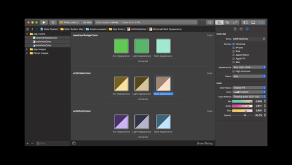](https://developer.apple.com/videos/play/wwdc2018/209/)

## [What's New in Cocoa for macOS](https://developer.apple.com/videos/play/wwdc2018/209/)

  Gain insights into the latest in Cocoa frameworks for macOS. Hear about Dark Mode, control tinting, contextual workflows for Touch Bar and Finder, and other improvements in AppKit, Foundation, and related areas. Get an overview and guide to the sessions that we have this year covering...

[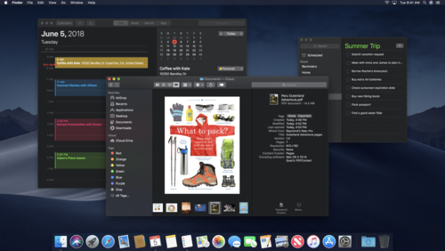](https://developer.apple.com/videos/play/wwdc2018/210/)

## [Introducing Dark Mode](https://developer.apple.com/videos/play/wwdc2018/210/)

  Hear from the Apple design team about the principles and concepts that anchor Dark Mode. Learn the basics of enhancing your app with this new appearance, and add an experience that people are sure to love.

## [Introduction to Siri Shortcuts](https://developer.apple.com/videos/play/wwdc2018/211/)

  Siri Shortcuts are a powerful new feature in iOS 12 that allow your app to expose its functionality to Siri. This enables Siri to suggest your shortcut at relevant times based on various context. Shortcuts can also be added to Siri to run with a voice phrase on iOS, HomePod and watchOS. Learn how...

[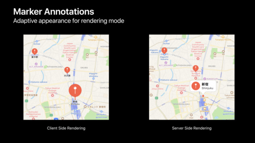](https://developer.apple.com/videos/play/wwdc2018/212/)

## [Introducing MapKit JS](https://developer.apple.com/videos/play/wwdc2018/212/)

  MapKit JS brings Apple Maps to your website. See how MapKit JS provides map rendering that is optimized for various browsers and devices, and supports native gestures such as pinch-to-zoom, two-finger rotate, and more. Learn how to add annotations and overlays, and how to use JavaScript...

[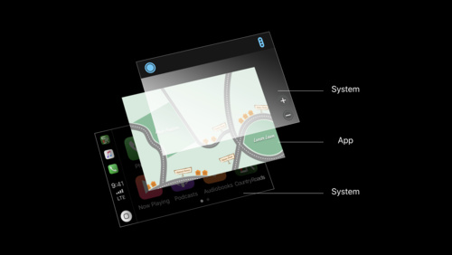](https://developer.apple.com/videos/play/wwdc2018/213/)

## [CarPlay Audio and Navigation Apps](https://developer.apple.com/videos/play/wwdc2018/213/)

  Learn how to update your audio or navigation app to support CarPlay. Apps in CarPlay are optimized for use in the car, and automatically adapt to available vehicle screens and input controls. Audio apps can deliver music, news, podcasts, and more. With the new CarPlay framework, Navigation apps...

[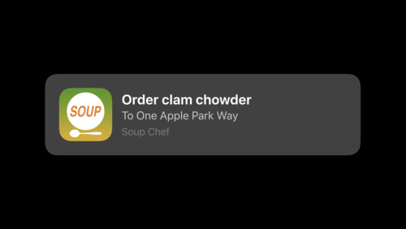](https://developer.apple.com/videos/play/wwdc2018/214/)

## [Building for Voice with Siri Shortcuts](https://developer.apple.com/videos/play/wwdc2018/214/)

  Siri Shortcuts are a great way to help people execute actions or get information from your app, but shortcuts can be made even more powerful by adding them to Siri to be used with a simple phrase. Learn how you can now customize responses from Siri and add custom UI to make a great shortcuts...

[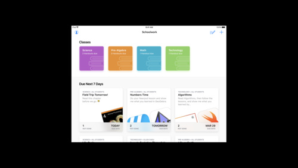](https://developer.apple.com/videos/play/wwdc2018/215/)

## [Introducing ClassKit](https://developer.apple.com/videos/play/wwdc2018/215/)

  The new ClassKit framework lets you organize educational content in your app so that teachers can discover and assign specific activities and view students' progress in the new Schoolwork app. Learn how to adopt ClassKit to your content structure, declare assignable content, and share student...

[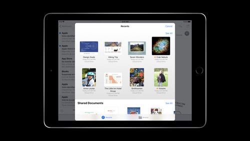](https://developer.apple.com/videos/play/wwdc2018/216/)

## [Managing Documents In Your iOS Apps](https://developer.apple.com/videos/play/wwdc2018/216/)

  Last year we introduced the Files App and an easy way to view, edit, and share documents within your application. Learn best practices for implementing this technology, how to effectively manage documents in your app, and how to avoid common document manager pitfalls. Hear about the difference...

[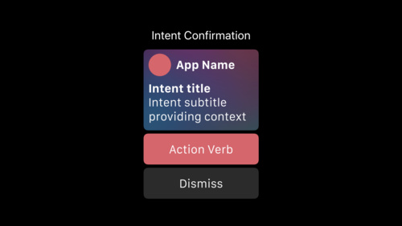](https://developer.apple.com/videos/play/wwdc2018/217/)

## [Siri Shortcuts on the Siri Watch Face](https://developer.apple.com/videos/play/wwdc2018/217/)

  Learn how to use Siri Shortcuts to bring glanceable information and custom interactions to the Siri watch face. Walk through how to create a compelling user experience by providing relevant shortcuts and by donating interactions from your app. See how these experiences can be created from both...

[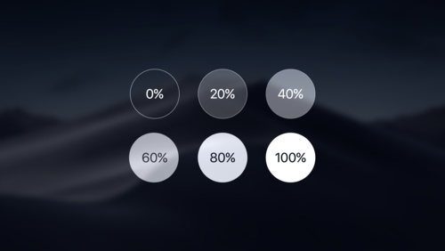](https://developer.apple.com/videos/play/wwdc2018/218/)

## [Advanced Dark Mode](https://developer.apple.com/videos/play/wwdc2018/218/)

  Step deeper into Dark Mode adoption in your macOS application. Learn about the powerful Cocoa technologies at the core of Dark Mode, and take a detailed look at the APIs and best practices for adapting to this beautiful new look.

## [Image and Graphics Best Practices](https://developer.apple.com/videos/play/wwdc2018/219/)

  Whether it's for UI elements or a fundamental part of your application, at some point, you have to handle images. This session is packed with engaging insight into how images are handled in iOS including discussion of UIImage, UIImageView, custom drawing in UIKit, plus advanced CPU and GPU...

[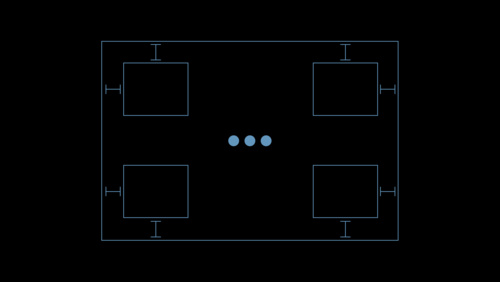](https://developer.apple.com/videos/play/wwdc2018/220/)

## [High Performance Auto Layout](https://developer.apple.com/videos/play/wwdc2018/220/)

  Get a glimpse inside to find out what happens when you add a constraint! Dive into the internals of Auto Layout to develop intuition for how your code affects what happens under the hood. Learn how to measure and refine your approach to Auto Layout and see how its improved performance in iOS 12...

[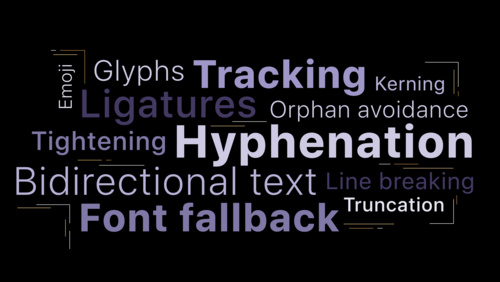](https://developer.apple.com/videos/play/wwdc2018/221/)

## [TextKit Best Practices](https://developer.apple.com/videos/play/wwdc2018/221/)

  Leverage the abilities of TextKit to provide the best experience possible displaying and editing text. Get the best performance out of your app by using TextKit effectively. Learn the concepts to do more complex handling, layout and presentation.

[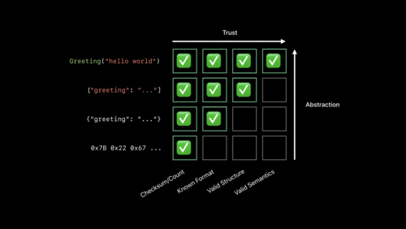](https://developer.apple.com/videos/play/wwdc2018/222/)

## [Data You Can Trust](https://developer.apple.com/videos/play/wwdc2018/222/)

  A lot can go wrong when loading data into your app. Whether you work directly with JSON and property lists, or with higher-level APIs such as NSCoding and Codable, learn how to defend your customers and secure your code against invalid or malicious data. Avoid fatal assumptions by validating...

## [🤠 Cette session vous apprendra à prendre le taureau par les cornes.](https://developer.apple.com/videos/play/wwdc2018/223/)

  To Be Announced

[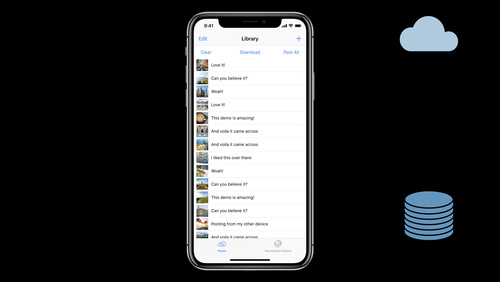](https://developer.apple.com/videos/play/wwdc2018/224/)

## [Core Data Best Practices](https://developer.apple.com/videos/play/wwdc2018/224/)

  As your app gains more customers and becomes more feature-rich, you may find yourself with new problems to solve. Core Data is a powerful tool that has changed a lot over the years. Learn about the new best practices in Core Data, such as how to use concurrency and persistent history, and...

## [A Tour of UICollectionView](https://developer.apple.com/videos/play/wwdc2018/225/)

  UICollectionView is a flexible, powerful tool to help you achieve great user experiences in your applications. Hear how you can leverage these rich APIs to rapidly move from initial design ideas to polished shipping applications. Topics range from getting started to advanced update animations and...

## [VoiceOver: App Testing Beyond The Visuals](https://developer.apple.com/videos/play/wwdc2018/226/)

  VoiceOver provides spoken descriptions and braille output of onscreen elements. Learn how to go beyond the visuals to identify VoiceOver and functional issues to help improve the experience for all users.

[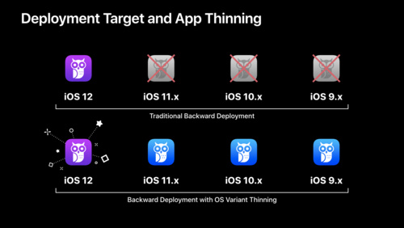](https://developer.apple.com/videos/play/wwdc2018/227/)

## [Optimizing App Assets](https://developer.apple.com/videos/play/wwdc2018/227/)

  Learn how to use assets to bring visually compelling and data efficient artwork to your apps, leveraging new features in iOS 12\. Gain insight into organizing, optimizing, and authoring artwork assets by using asset catalogs to their fullest. Learn techniques to better streamline workflows between...

[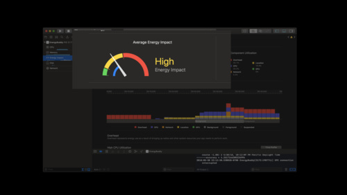](https://developer.apple.com/videos/play/wwdc2018/228/)

## [What’s New in Energy Debugging](https://developer.apple.com/videos/play/wwdc2018/228/)

  People expect long battery life on their mobile devices, and apps play a vital role in achieving that experience. Understand how app behavior affects battery consumption, and learn strategies to conserve energy while providing the best experience for your app. Find out how Xcode Energy Reports...

[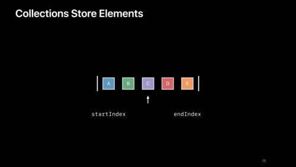](https://developer.apple.com/videos/play/wwdc2018/229/)

## [Using Collections Effectively](https://developer.apple.com/videos/play/wwdc2018/229/)

  Every app uses collections! Go beyond the basics with specific tips on how best to use indices, slices, bridging, laziness, and reference types. Gain better understanding of when to use each collection for best performance.

[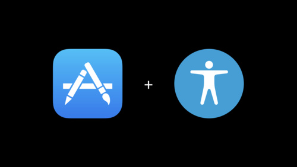](https://developer.apple.com/videos/play/wwdc2018/230/)

## [Deliver an Exceptional Accessibility Experience](https://developer.apple.com/videos/play/wwdc2018/230/)

  Go beyond the basics and create apps with an exceptional accessibility experience. Learn how to design elements that appear in your app for maximum clarity and accessibility. Discover how to enhance the way users interact with your app even when presenting custom views, or drawing complex UI.

## [HomeKit Deep Dive](https://developer.apple.com/videos/play/wwdc2018/231/)

  Get a fresh look at the HomeKit APIs. Understand how Siri and the Apple Home App use Action Sets and Accessory Services & Characteristics to provide a great home automation experience.

[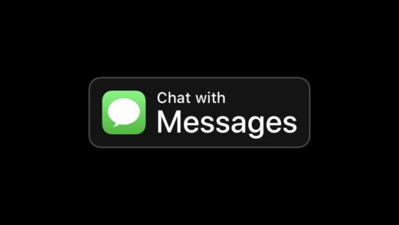](https://developer.apple.com/videos/play/wwdc2018/232/)

## [Getting Ready for Business Chat](https://developer.apple.com/videos/play/wwdc2018/232/)

  Business Chat is a powerful way for organizations to connect with customers directly from within Messages. Whether you are a Customer Service Platform provider, a brand looking to integrate chat for customer communication, or a brand app developer looking to extend your iOS app to enhance...

## [Adding Delight to your iOS App](https://developer.apple.com/videos/play/wwdc2018/233/)

  iOS contains powerful technologies you can use to make your app truly delightful. Learn how to take your app to the next level with easy-to-implement features such as Handoff and External Display support. Preserve that feeling of magic in your app with pro-tips that combine animations, gestures...

[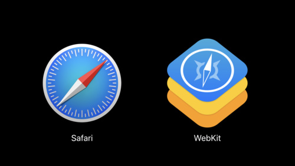](https://developer.apple.com/videos/play/wwdc2018/234/)

## [What’s New in Safari and WebKit](https://developer.apple.com/videos/play/wwdc2018/234/)

  Safari and WebKit are continually evolving with new features, APIs, and cutting edge web standards. Learn about this year's biggest feature highlights, designed to help you create richer experiences with better performance and security — whether you are developing content for a browser or...

[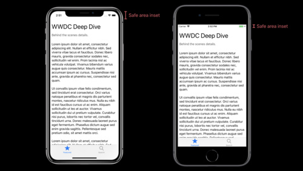](https://developer.apple.com/videos/play/wwdc2018/235/)

## [UIKit: Apps for Every Size and Shape](https://developer.apple.com/videos/play/wwdc2018/235/)

  Ground-up coverage of how to make an app that can fit on devices of every size and shape. Make your app fit beautifully on Apple's full range of devices with the minimum amount of effort, future-proofing your user experience along the way.

## [AVSpeechSynthesizer: Making iOS Talk](https://developer.apple.com/videos/play/wwdc2018/236/)

  Speech can enhance the audio experience of your app, whether you are generating spoken feedback for accessibility, or providing critical information beyond simple alerts or notifications. AVSpeechSynthesizer produces synthesized speech from text and allows you to control and monitor the progress...

## [Quick Look Previews from the Ground Up](https://developer.apple.com/videos/play/wwdc2018/237/)

  Quicklook Previews are an easy way preview documents in your app. Hear about the basics as well as some advanced implementations. Learn to present a variety of types of documents from within your app without reinventing the wheel, and make sure your custom file format works great with the...

## [What's New in TVMLKit](https://developer.apple.com/videos/play/wwdc2018/238/)

  With TVMLKit you can quickly and easily develop tvOS apps that deliver intuitive and engaging media experiences. Learn about enhancements to data binding that allow you to separate your application logic and user interface, and new features and functions to customize the media playback experience.

## [Designing Web Content for watchOS](https://developer.apple.com/videos/play/wwdc2018/239/)

  watchOS 5 brings web content to Apple Watch by rendering rich HTML in Messages and Mail. Gain insights into how watchOS maintains compatibility with existing web content, and find out what you can do to optimize your web content for Apple Watch.

## [Accessible Drag and Drop](https://developer.apple.com/videos/play/wwdc2018/241/)

  Drag and Drop is a powerful API that allows apps to share and communicate data. No matter how you decide to implement Drag and Drop, there's a way to make it work for people with accessibility needs. Learn the details as we dive into accessible Drag and Drop for iOS.

[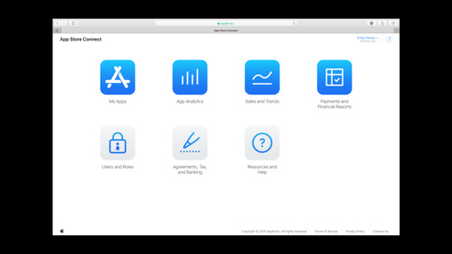](https://developer.apple.com/videos/play/wwdc2018/301/)

## [What's New in App Store Connect](https://developer.apple.com/videos/play/wwdc2018/301/)

  App Store Connect is constantly evolving to improve the experience of managing and deploying your app on App Store. Learn about the new App Store Connect API for managing frequently modified data such as users and groups, see the latest updates to Sales Trends and Analytics reporting, and...

## [What's New in Managing Apple Devices](https://developer.apple.com/videos/play/wwdc2018/302/)

  Learn about new management capabilities for iOS, macOS, and tvOS, tool evolution over the past year, and important changes coming this fall. You'll discover how new MDM features help administrators manage devices more effectively, how educators can enhance the classroom learning environment, and...

[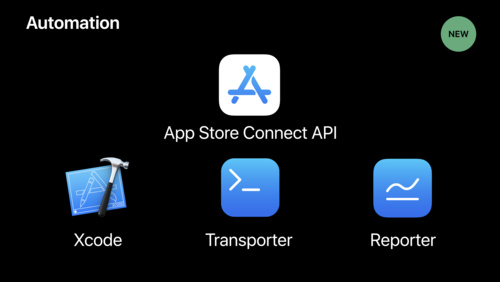](https://developer.apple.com/videos/play/wwdc2018/303/)

## [Automating App Store Connect](https://developer.apple.com/videos/play/wwdc2018/303/)

  The new App Store Connect API provides a familiar and highly readable REST API designed to facilitate the automation of many tasks you would typically perform through the Apple Developer website and the App Store Connect browser interfaces. Learn how this API allows you to manage your apps and...

[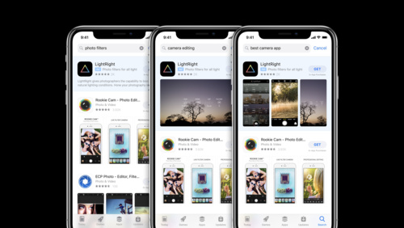](https://developer.apple.com/videos/play/wwdc2018/304/)

## [What's New in Search Ads](https://developer.apple.com/videos/play/wwdc2018/304/)

  Search Ads are a great way to help people discover your app in App Store search results. Learn how new market expansion will give you greater opportunities to reach high quality customers. See how new Search Ads Advanced tools such as customized reporting and additional creative variations will...

[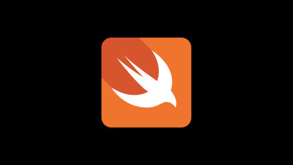](https://developer.apple.com/videos/play/wwdc2018/401/)

## [What's New in Swift](https://developer.apple.com/videos/play/wwdc2018/401/)

  Hear about the latest advancements in Swift, the safe, fast, and expressive language. Find out about improvements to build times, code size, and runtime performance. Learn how to take advantage of new features in your code that eliminate boilerplate, increase safety and security, and improve your...

[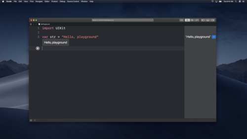](https://developer.apple.com/videos/play/wwdc2018/402/)

## [Getting the Most out of Playgrounds in Xcode](https://developer.apple.com/videos/play/wwdc2018/402/)

  Discover major advancements in Xcode playgrounds. Learn advanced tips and techniques, hear about new and often overlooked workflows, and rediscover the tools provided when coding in playgrounds.

[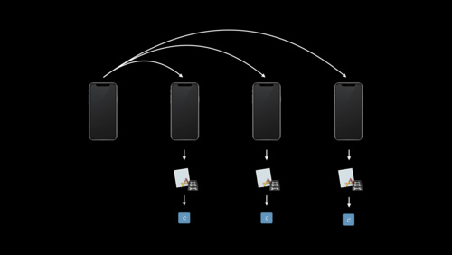](https://developer.apple.com/videos/play/wwdc2018/403/)

## [What's New in Testing](https://developer.apple.com/videos/play/wwdc2018/403/)

  Hear about exciting improvements to code coverage, including how you can build your own automation on top of Xcode's coverage reports. Learn how to dramatically speed up the execution of your tests by leveraging distributed parallel testing, new in Xcode 10.

[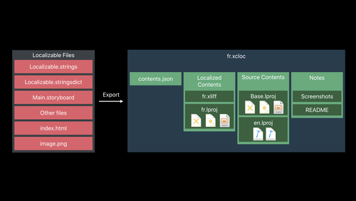](https://developer.apple.com/videos/play/wwdc2018/404/)

## [New Localization Workflows in Xcode 10](https://developer.apple.com/videos/play/wwdc2018/404/)

  The localization process in Xcode 10 has been updated to aid you through the lifecycle of exporting, importing, and testing localized content in your apps. See new functionality added in Xcode 10 and learn how the new localization catalog helps you build world-class, localized apps.

[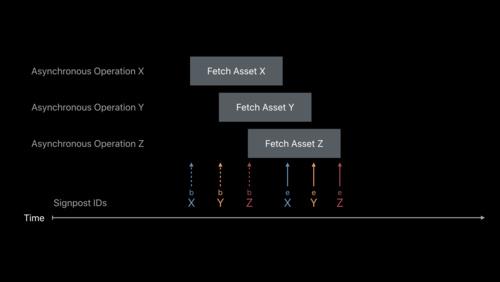](https://developer.apple.com/videos/play/wwdc2018/405/)

## [Measuring Performance Using Logging](https://developer.apple.com/videos/play/wwdc2018/405/)

  Learn how to use signposts and logging to measure performance. Understand how the Points of Interest instrument can be used to examine logged data. Get an introduction into creating and using custom instruments.

[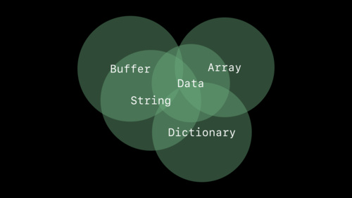](https://developer.apple.com/videos/play/wwdc2018/406/)

## [Swift Generics](https://developer.apple.com/videos/play/wwdc2018/406/)

  Generics are one of the most powerful features of Swift, enabling you to write flexible, reusable components while maintaining static type information. Learn about the design of Swift's generics, including how to generalize protocols, leverage protocol inheritance to express the varying...

[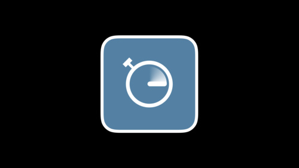](https://developer.apple.com/videos/play/wwdc2018/407/)

## [Practical Approaches to Great App Performance](https://developer.apple.com/videos/play/wwdc2018/407/)

  All apps benefit from a focus on performance and an increase in overall responsiveness. This information packed session gives you strategies for fixing performance problems using Instruments and other tools. Additionally, get practical advice based on experience in tuning Apple's own apps...

[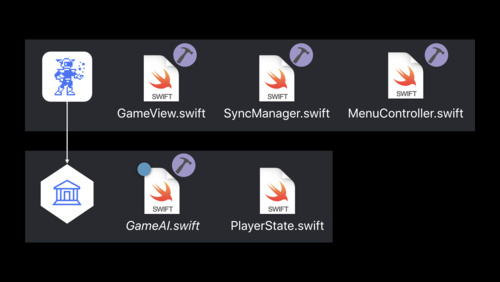](https://developer.apple.com/videos/play/wwdc2018/408/)

## [Building Faster in Xcode](https://developer.apple.com/videos/play/wwdc2018/408/)

  Build your apps faster in Xcode 10\. Learn how to structure your projects and tweak your code to take full advantage of all processor cores. Whether you've made a few small code changes you want to give a try, or you're building your full app for release, these techniques will cut the time it...

[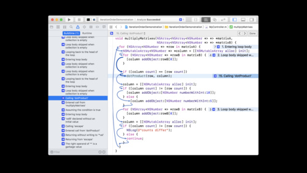](https://developer.apple.com/videos/play/wwdc2018/409/)

## [What's New in LLVM](https://developer.apple.com/videos/play/wwdc2018/409/)

  The LLVM suite of compiler tools in Xcode 10 have new language features, improved diagnostics, and more powerful optimizations. Find out about improvements to ARC for Objective-C, keep up with the newest additions to C++, get an overview of new and improved diagnostics and static analyzer checks,...

## [Creating Custom Instruments](https://developer.apple.com/videos/play/wwdc2018/410/)

  Understand how custom instruments are useful and when they should be used. Get an in-depth view of the architecture of custom instruments and how to create them. Understand the attributes of a good instrument. Dive into advanced modeling and how to use the CLIPS language.

[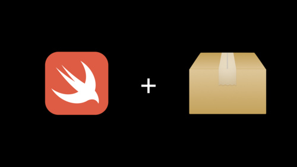](https://developer.apple.com/videos/play/wwdc2018/411/)

## [Getting to Know Swift Package Manager](https://developer.apple.com/videos/play/wwdc2018/411/)

  The Swift Package Manager makes it possible to easily develop and distribute source code in the Swift ecosystem. Learn about its goals, design, unique features, and the opportunities it has for continued evolution.

[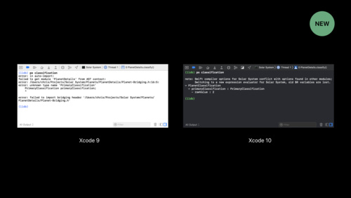](https://developer.apple.com/videos/play/wwdc2018/412/)

## [Advanced Debugging with Xcode and LLDB](https://developer.apple.com/videos/play/wwdc2018/412/)

  Discover advanced techniques, and tips and tricks for enhancing your Xcode debugging workflows. Learn how to take advantage of LLDB and custom breakpoints for more powerful debugging. Get the most out of Xcode's view debugging tools to solve UI issues in your app more efficiently.

[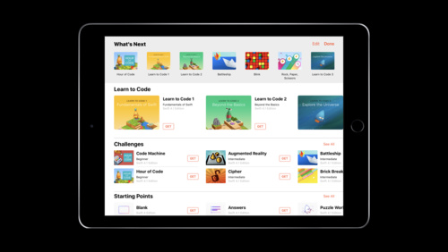](https://developer.apple.com/videos/play/wwdc2018/413/)

## [Create Your Own Swift Playgrounds Subscription](https://developer.apple.com/videos/play/wwdc2018/413/)

  Swift Playgrounds is a revolutionary iPad app to teach coding with the powerful Swift programming language. Learn how to create your own content for Swift Playgrounds using the new template, and find out how to use the subscription format to host your own feed online for others to access.

[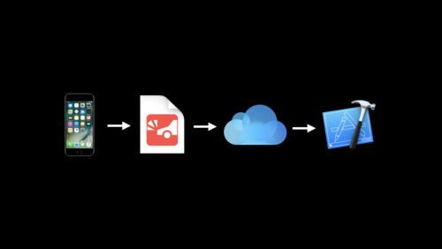](https://developer.apple.com/videos/play/wwdc2018/414/)

## [Understanding Crashes and Crash Logs](https://developer.apple.com/videos/play/wwdc2018/414/)

  Sudden app crashes are a source of bad user experience and app review rejections. Learn how crash logs can be analyzed, what information they contain and how to diagnose the causes of crashes, including hard-to-reproduce memory corruptions and multithreading issues.

[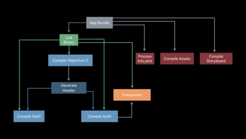](https://developer.apple.com/videos/play/wwdc2018/415/)

## [Behind the Scenes of the Xcode Build Process](https://developer.apple.com/videos/play/wwdc2018/415/)

  Ever wonder what happens when you build your project in Xcode? Learn how Xcode automates the steps required to build an application, and go behind the scenes to learn how clang, swiftc, and the linker work together to turn your source code into a working program.

[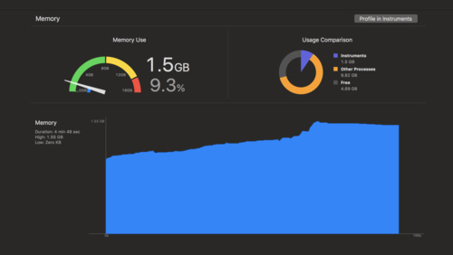](https://developer.apple.com/videos/play/wwdc2018/416/)

## [iOS Memory Deep Dive](https://developer.apple.com/videos/play/wwdc2018/416/)

  Discover how memory graphs can be used to get a close up look at what is contributing to an app's memory footprint. Understand the true memory cost of an image. Learn some tips and tricks for reducing the memory footprint of an app.

## [Testing Tips & Tricks](https://developer.apple.com/videos/play/wwdc2018/417/)

  Testing is an essential tool to consistently verify your code works correctly, but often your code has dependencies that are out of your control. Discover techniques for making hard-to-test code testable on Apple platforms using XCTest. Learn a variety of tips for writing higher-quality tests...

## [Source Control Workflows in Xcode](https://developer.apple.com/videos/play/wwdc2018/418/)

  Xcode integrates with GitHub, Bitbucket, and GitLab to help you manage your source code, back up your files, and collaborate with others. Find out how to easily see the changes in your project right in the source editor, and learn how to use Xcode for common source control workflows with Git. See...

[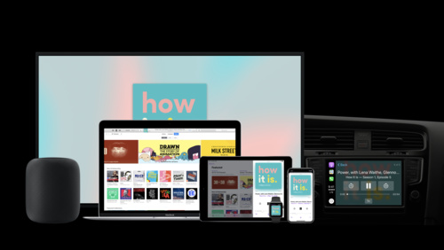](https://developer.apple.com/videos/play/wwdc2018/501/)

## [Introducing Podcast Analytics](https://developer.apple.com/videos/play/wwdc2018/501/)

  Podcasts are created and enjoyed by millions of people around the world. With the addition of Podcast Analytics, podcasters can gather actionable and insightful intelligence into how their show is consumed, while respecting the privacy of their listeners. Learn how to interpret and use these new...

[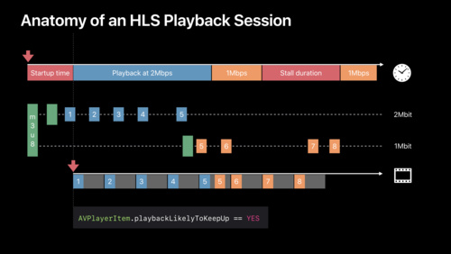](https://developer.apple.com/videos/play/wwdc2018/502/)

## [Measuring and Optimizing HLS Performance](https://developer.apple.com/videos/play/wwdc2018/502/)

  HTTP Live Streaming (HLS) is used to stream live and on-demand content to global audiences. Discover how to adjust and tune stream authoring and delivery elements to improve the viewing experience. Learn how to accurately measure your streaming performance, identify optimization opportunities,...

[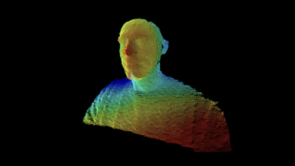](https://developer.apple.com/videos/play/wwdc2018/503/)

## [Creating Photo and Video Effects Using Depth](https://developer.apple.com/videos/play/wwdc2018/503/)

  The TrueDepth camera in the iPhone X streams high-quality depth data in real time allowing you to enhance your photo and video apps in fun and creative ways. Dive deep into the principles and best practices for working with depth data, learn how to use the new Portrait Segmentation API for still...

## [Creating Audio Apps for watchOS](https://developer.apple.com/videos/play/wwdc2018/504/)

  Apps in watchOS 5 have control over audio playback like never before. With a full-fledged background mode for local audio playback using AVFoundation, people can listen to content on the go right from Apple Watch. Learn how to use the new volume control and how to respond to MediaRemote...

## [Integrating with Photos on macOS](https://developer.apple.com/videos/play/wwdc2018/505/)

  Make your apps even better through improved integration with Photos on macOS. We'll dive deep into the Photos Project Extension API that was introduced in macOS High Sierra and update you on what's new. You'll also learn best practices for handling file promises and image URLs to better handle...

[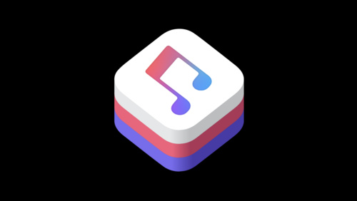](https://developer.apple.com/videos/play/wwdc2018/506/)

## [MusicKit on the Web](https://developer.apple.com/videos/play/wwdc2018/506/)

  MusicKit has enabled the creation of new, compelling, and engaging Apple Music powered app experiences. With the introduction of MusicKit on the web, as a developer, you can now bring Apple Music powered experiences to the web. Learn how to use declarative markup or javascript to enable Apple...

## [AVContentKeySession Best Practices](https://developer.apple.com/videos/play/wwdc2018/507/)

  AVContentKeySession allows for the management of FairPlay content decryption keys for HTTP Live Streaming. It offers a simplified key loading process that provides applications with control over the lifecycle of content keys, and features such as dual-expiry keys for offline movie rentals. Learn...

## [🏎️ You’ll want to get up to speed with this one.](https://developer.apple.com/videos/play/wwdc2018/508/)

  To Be Announced

[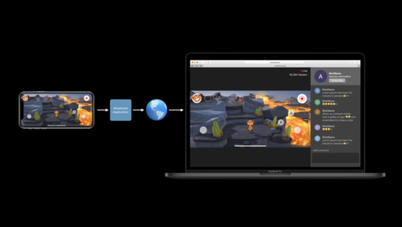](https://developer.apple.com/videos/play/wwdc2018/601/)

## [Live Screen Broadcast with ReplayKit](https://developer.apple.com/videos/play/wwdc2018/601/)

  ReplayKit 2 provides built-in services for broadcasting your screen from iOS and tvOS to viewers online. See how broadcasts can be started right within Control Center or from standard UI included in your own apps and games. Hear about developing broadcast extensions for ReplayKit 2 and get best...

## [What’s New in ARKit 2](https://developer.apple.com/videos/play/wwdc2018/602/)

  ARKit 2 makes it easy to develop vivid augmented reality experiences and enable apps to interact with the real world in entirely new ways. Discover how multiple iOS devices can simultaneously view an AR scene or play multiplayer AR games. Learn about new capabilities for tracking 2D images, and...

## [Integrating Apps and Content with AR Quick Look](https://developer.apple.com/videos/play/wwdc2018/603/)

  With iOS 12, ARKit includes a built-in viewer for displaying and sharing high-quality 3D content using Pixar's usdz file format. Get introduced to the capabilities of AR Quick Look and see how to easily integrate AR into your app. Learn best practices for preparing 3D models for AR, and see how...

## [Metal for OpenGL Developers](https://developer.apple.com/videos/play/wwdc2018/604/)

  Metal is the foundation for accelerated graphics and compute on Apple platforms, enabling your apps and games to tap into the incredible power of the GPU. Get introduced to essential Metal capabilities and understand the recommended approach for transitioning OpenGL-based apps onto the Metal API.

## [Inside SwiftShot: Creating an AR Game](https://developer.apple.com/videos/play/wwdc2018/605/)

  Developed by Apple, SwiftShot is an energetic and immersive multiplayer AR game built with key iOS technologies. Glimpse behind the curtain and see how SwiftShot was designed and developed using ARKit, SceneKit, and Swift. Understand the intricacies of designing great gameplay for AR, and learn...

## [Metal for Ray Tracing Acceleration](https://developer.apple.com/videos/play/wwdc2018/606/)

  Metal Performance Shaders (MPS) harnesses the massive parallelism of the GPU to dramatically accelerate calculations at the heart of modern ray tracing and ray casting techniques. See how ray tracing can provide greater realism in 3D scenes through improved shading, soft shadows, and global...

## [Metal for Game Developers](https://developer.apple.com/videos/play/wwdc2018/607/)

  Metal 2 is Apple-designed graphics software that lets developers build console‑style games. Learn key aspects of the Metal architecture that support the techniques for modern high-performance game rendering. See how Metal now enables the GPU to schedule work for itself, allowing complete scenes...

## [Metal Shader Debugging and Profiling](https://developer.apple.com/videos/play/wwdc2018/608/)

  Metal provides powerful tools for analyzing shader behavior and optimizing performance. Dive into troubleshooting vertex-stage problems with new geometry viewing capabilities in Xcode. Use the shader debugger to step through vertex, fragment, and compute shader execution line-by-line. Get details...

## [Metal for Accelerating Machine Learning](https://developer.apple.com/videos/play/wwdc2018/609/)

  Metal Performance Shaders (MPS) includes a highly tuned library of machine learning primitives leveraging the tremendous power of the GPU. With iOS 12 and macOS Mojave, MPS adds capabilities to accelerate the computationally intensive task of training a neural network. Learn performance...

## [Understanding ARKit Tracking and Detection](https://developer.apple.com/videos/play/wwdc2018/610/)

  With ARKit your app can see the world and place virtual objects on horizontal and vertical surfaces and recognize images and objects. Go beyond the API to gain insights into the innovative methods and techniques underlying these capabilities. See how ARKit combines device motion with the camera...

## [Metal for VR](https://developer.apple.com/videos/play/wwdc2018/611/)

  On macOS, Metal 2 adds specialized support for virtual reality (VR) rendering and external GPUs. Learn about new features and optimizations to take advantage of these technologies within your Metal 2-based apps and games. Understand best practices for scheduling workloads across multiple GPUs and...

## [Metal Game Performance Optimization](https://developer.apple.com/videos/play/wwdc2018/612/)

  Realize the full potential of your Metal-based games by tackling common issues that cause frame rate slowdowns, stutters, and stalls. Discover how to clear up jitter and maintain a silky-smooth frame rate with simple changes in frame pacing. Get introduced to new tools for analyzing rendering...

## [Using Accelerate and simd](https://developer.apple.com/videos/play/wwdc2018/701/)

  Learn how to use sophisticated Signal and Image Processing techniques to bring higher performance to your apps while lowering battery consumption. See compelling use cases for the Accelerate framework with interactive demos. Explore using simd—a valuable addition that effortlessly brings...

## [Your Apps and the Future of macOS Security](https://developer.apple.com/videos/play/wwdc2018/702/)

  Apple is on a mission to advance the state of Mac security, and we want your apps to be there with us. Learn about new protections for user data, new capabilities with Developer ID, and how you can best secure your apps.

## [Introducing Create ML](https://developer.apple.com/videos/play/wwdc2018/703/)

  Create ML is a new framework designed to help you easily build machine learning models using Swift and Xcode. Designed for Simplicity and Performance. Learn how you can build customized models from data that will enable new and powerful features in your apps using Create ML.

## [Best Practices and What’s New with In-App Purchases](https://developer.apple.com/videos/play/wwdc2018/704/)

  Learn about the latest updates in StoreKit, including offering introductory pricing for subscriptions, requesting ratings and reviews, promoting your in-app purchases within the App Store, and developing in the sandbox environment. Dive deep into best practices for processing transactions and...

## [Engineering Subscriptions](https://developer.apple.com/videos/play/wwdc2018/705/)

  Learn the best practices for architecting your subscription infrastructure using StoreKit and server-side logic. Find out about simple engineering techniques to keep your subscribers longer, and how to utilize new tools and APIs to give your subscribers the best experience.

## [Accessing Health Records with HealthKit](https://developer.apple.com/videos/play/wwdc2018/706/)

  HealthKit provides a consolidated repository for a variety of data including health records containing information such as lab results, immunizations, and medications downloaded directly from institutions. Discover new health records classes and types created to provide easy access to high-level...

## [New Ways to Work with Workouts](https://developer.apple.com/videos/play/wwdc2018/707/)

  Tracking workouts with Apple Watch is popular with fitness professionals and novices alike. See how the new workout API streamlines the entire lifecycle of a workout, complete with ability to restart a session after a crash to prevent you from losing data. Learn how the new workout classes,...

## [What’s New in Core ML, Part 1](https://developer.apple.com/videos/play/wwdc2018/708/)

  Introduced just one year ago, Core ML has already revolutionized the way apps can benefit from machine learning, by enabling fast and private on device machine learning features for your app. Find out how new Core ML features let you reduce the size of models, make them more flexible, and...

## [What’s New in Core ML, Part 2](https://developer.apple.com/videos/play/wwdc2018/709/)

  The Core ML tools ecosystem gives you many options for building and optimizing models to meet your app requirements. Learn how to add flexibility to existing models, quantize them, and take advantage of Core ML's support for customization.

## [What’s New in User Notifications](https://developer.apple.com/videos/play/wwdc2018/710/)

  Local and push notifications enable your app to keep users informed with timely and relevant content, by displaying messages and accepting users' actions, or playing distinctive sounds, or updating the badge on your app icon. Improvements to rich notifications help you create more engaging...

## [Using Grouped Notifications](https://developer.apple.com/videos/play/wwdc2018/711/)

  Grouping the notifications your app sends helps people get more information at a glance and manage multiple notifications at once. Learn how to implement Grouped Notifications in your app.

## [A Guide to Turi Create](https://developer.apple.com/videos/play/wwdc2018/712/)

  Turi Create is an open source toolset for creating Core ML models, for tasks such as image classification, object detection, style transfers, recommendations, and more. Learn how you can use Turi Create to build models for your apps.

## [Introducing Natural Language Framework](https://developer.apple.com/videos/play/wwdc2018/713/)

  Natural Language is a redesigned framework designed to provide high-performance, on-device APIs for fundamental NLP tasks across all Apple platforms. Through the deep integration of the framework with Core ML and Create ML, you now have the ability to train custom NLP models to perform many...

## [Optimizing Your App for Today’s Internet](https://developer.apple.com/videos/play/wwdc2018/714/)

  Learn what Apple has been doing to help your app get the most out of the network with the least effort. Let Apple's networking APIs do the heavy lifting for you. Learn best practices for getting top networking performance from your app using the URLSession APIs.

## [Introducing Network.framework: A modern alternative to Sockets](https://developer.apple.com/videos/play/wwdc2018/715/)

  The new Network.framework API gives you direct access to the same high-performance user-space networking stack used by URLSession. If you're considering using Berkeley Sockets in your app or library, learn what better options are available to you.

## [Object Tracking in Vision](https://developer.apple.com/videos/play/wwdc2018/716/)

  Vision is a high-level framework that provides an easy to use API for handling many computer vision tasks. We'll dive deep into a particularly powerful feature of Vision—tracking objects in video streams. Learn best practices for using Vision in your app. Gain a greater understanding of how...

## [Vision with Core ML](https://developer.apple.com/videos/play/wwdc2018/717/)

  Using Core ML models in Vision makes the creation of powerful Computer Vision applications easy. Learn how easy it is to use custom trained classifiers and object recognition models in a live camera capture. In addition, you'll learn about the latest additions to the Vision Framework along with a...

## [Better Apps through Better Privacy](https://developer.apple.com/videos/play/wwdc2018/718/)

  At Apple, we believe in building products with both great features and great privacy. Learn how to apply privacy engineering techniques to your apps so you can build trust with users to unlock better experiences and engagement. And find out how new privacy features can benefit you and your users.

## [Core Image: Performance, Prototyping, and Python](https://developer.apple.com/videos/play/wwdc2018/719/)

  Core Image is the essential framework for handling image processing tasks in your photo and video apps. In this session, we'll explore new additions to the framework that allow you to achieve great performance in your filter chains and custom CIKernels. We'll also demo a new approach to...

## [Create Great Customer Experiences Using Wallet and Apple Pay](https://developer.apple.com/videos/play/wwdc2018/720/)

  Get the latest news and updates from the Wallet and Apple Pay team. Learn how iPhone and Apple Watch can power innovative commerce experiences. Hear about the latest design best practices for Apple Pay. And discover how to create your own contactless passes for rewards cards, gift cards, tickets...

## [Implementing AutoFill Credential Provider Extensions](https://developer.apple.com/videos/play/wwdc2018/721/)

  Password AutoFill delivers strong password recommendation and credential management within Safari and iOS apps requiring a user to log in. Join us to learn how app developers that provide credential management can participate in these new platform features to surface their managed AutoFill...

## [The Qualities of Great Design](https://developer.apple.com/videos/play/wwdc2018/801/)

  Great Design isn't magic, it is crafted with care by real people. Explore the characteristics of great design through the voices of designers from Apple and our developer community. Learn how they take inspiration from everyday life, conceive and refine ideas, and push themselves to design apps...

## [Intentional Design](https://developer.apple.com/videos/play/wwdc2018/802/)

  Great app experiences leap off the screen. They are dynamic, immersive, personal, and, above all else, the result of a strong and clear intent. Learn key techniques for being intentional with your design by choosing appropriate metaphors, making extreme choices, and making every interaction feel...

## [Designing Fluid Interfaces](https://developer.apple.com/videos/play/wwdc2018/803/)

  Discover the techniques used to create the fluid and dynamic interfaces of iOS and other Apple platforms. Learn how to design gestures and animations that feel intuitive and natural and will make your app delightful.

## [The Life of a Button](https://developer.apple.com/videos/play/wwdc2018/804/)

  An in-depth exploration of essential interaction, visual and sound design principles and techniques through the design of a simple button.

## [Creating Great AR Experiences](https://developer.apple.com/videos/play/wwdc2018/805/)

  Engaging AR experiences are easy to start and navigate, persuasively realistic, and highly immersive. Learn best practices for successfully bringing people into an AR experience, teaching them about how to interact and engage with virtual content, and making your AR content look beautiful and...

## [Designing Notifications](https://developer.apple.com/videos/play/wwdc2018/806/)

  Thoughtfully designed notifications are a powerful way to communicate timely information to people that they will find valuable and useful. Learn how you can design notifications people want to receive by making them beautiful, helpful, actionable, and respectful of their valuable time and...

## [Design Studio Shorts](https://developer.apple.com/videos/play/wwdc2018/807/)

  Five short presentations on a range of design topics including: Prototyping AR experiences by using the world around you and low-tech traditional prototyping techniques; Making your app more powerful and expressive with Apple Pencil; Indispensable techniques for presenting your design work;...